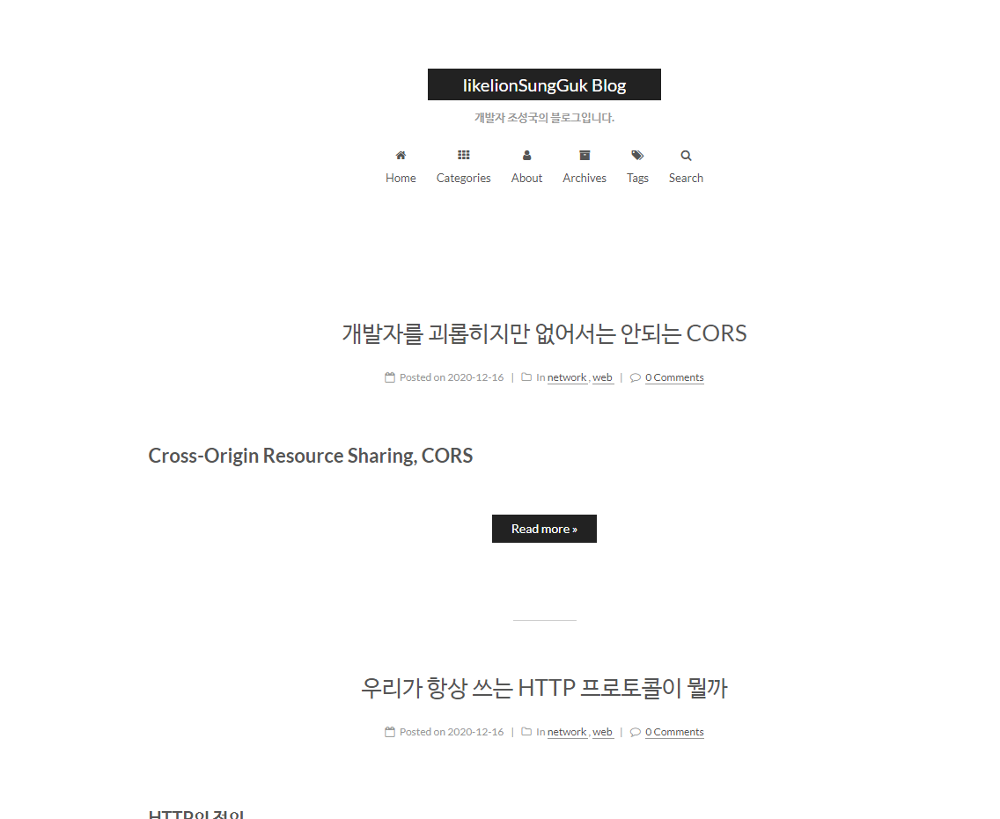
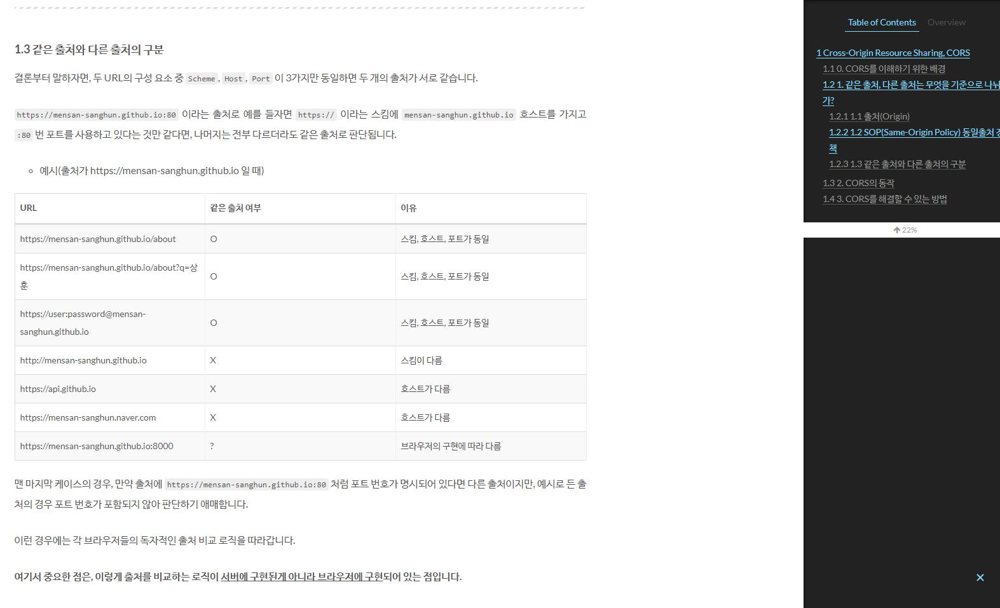
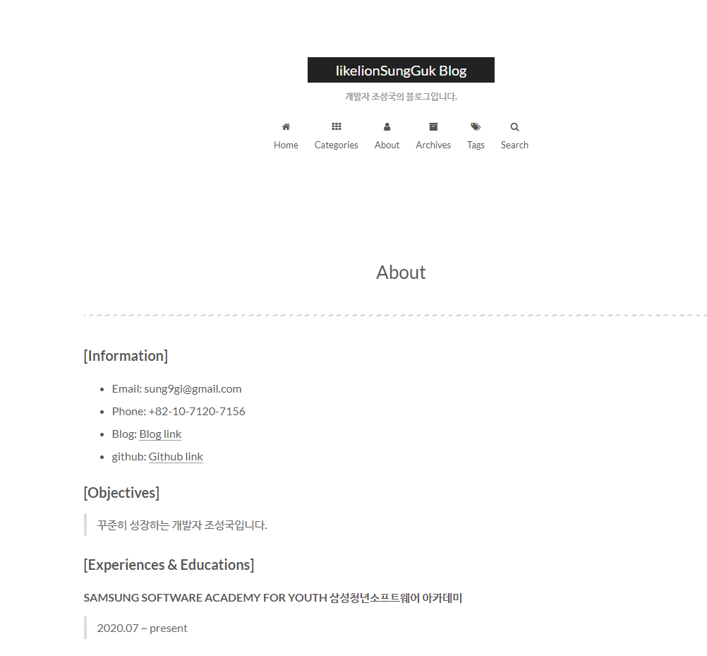
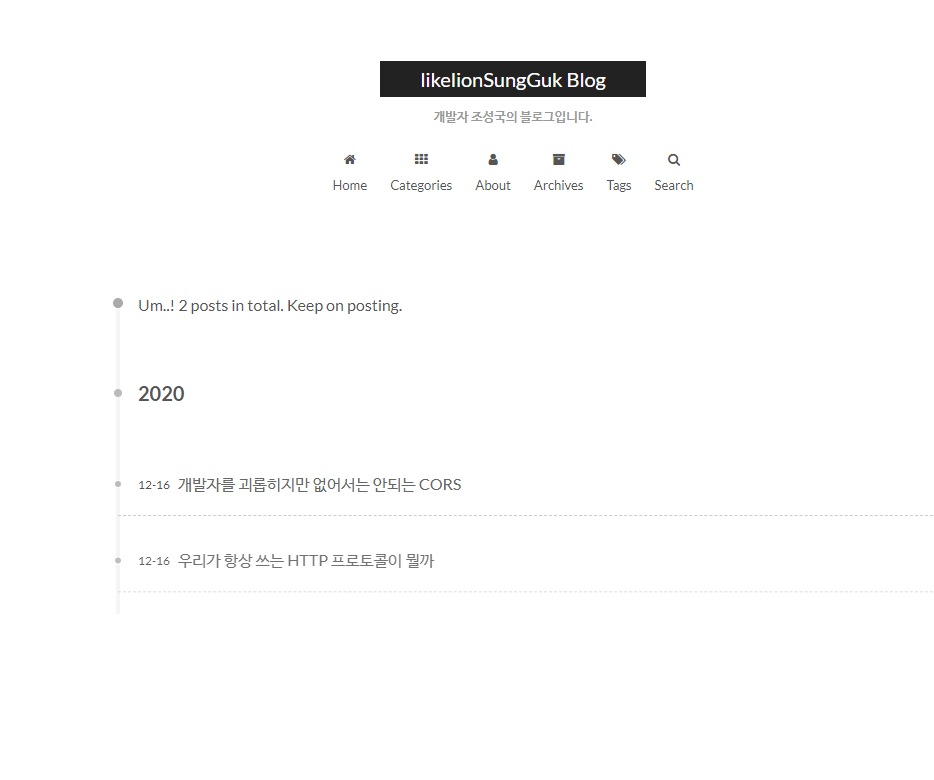
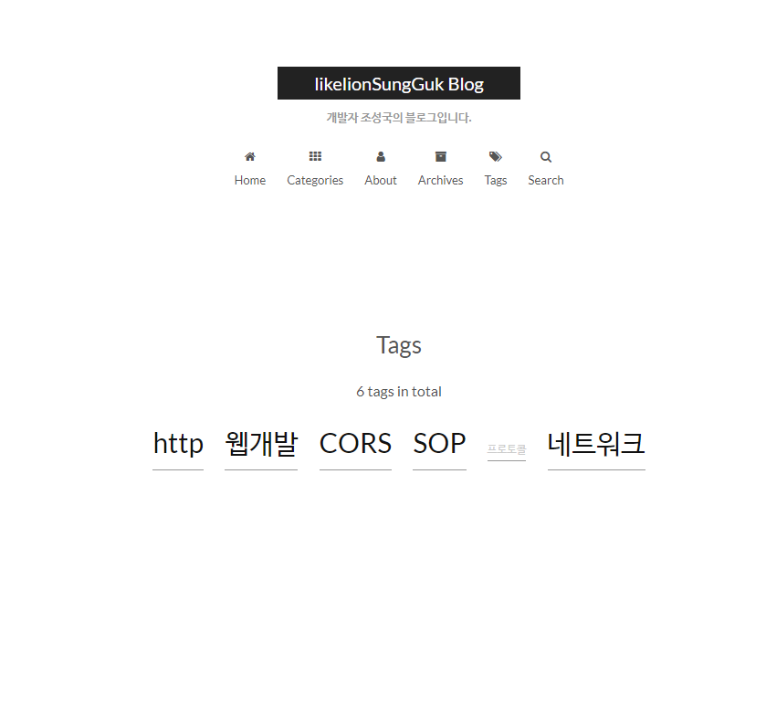
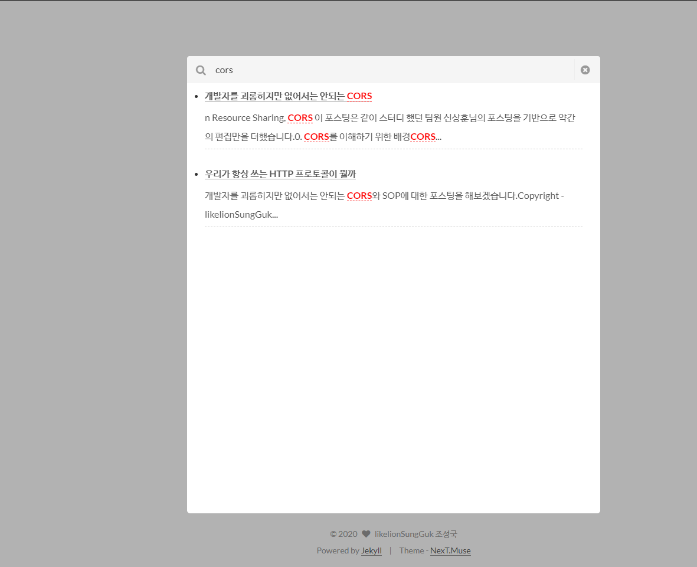

# likelionSungGuk.gihub.io Blog 만들기

jekyll의 Next theme을 사용해서 블로그를 만들고 싶은 분들은

#### [`jekyll Blog 만드는게 글쓰는 것보다 힘든 사람들에게`](https://likelionsungguk.github.io/20-12-17/jekyll-Blog-%EB%A7%8C%EB%93%9C%EB%8A%94%EA%B2%8C-%EA%B8%80%EC%93%B0%EB%8A%94-%EA%B2%83%EB%B3%B4%EB%8B%A4-%ED%9E%98%EB%93%A0-%EC%82%AC%EB%9E%8C%EB%93%A4%EC%97%90%EA%B2%8C) 포스팅을 참고해주세요

## Screenshots

* Home



* Posts & sidebar



* About



* Archives



* Tags



* Search




## Installation

Check whether you have `Ruby 2.1.0` or higher installed:

```sh
ruby --version
```

Install `Bundler`:

```sh
gem install bundler
```

Clone NexT theme:

```sh
git clone https://github.com/Simpleyyt/jekyll-theme-next.git
cd jekyll-theme-next
```

Install Jekyll and other dependencies from the GitHub Pages gem:

```sh
bundle install
```

Run your Jekyll site locally:

```sh
bundle exec jekyll server
```

More Details：[Setting up your GitHub Pages site locally with Jekyll](https://help.github.com/articles/setting-up-your-github-pages-site-locally-with-jekyll/)


## Features

### Multiple languages support, including: English / Russian / French / German / Simplified Chinese / Traditional Chinese.

Default language is English.

```yml
language: en
# language: zh-Hans
# language: fr-FR
# language: zh-hk
# language: zh-tw
# language: ru
# language: de
```

Set `language` field as following in site `_config.yml` to change to Chinese.

```yml
language: zh-Hans
```

### Comment support.

NexT has native support for `DuoShuo` and `Disqus` comment systems.

Add the following snippets to your `_config.yml`:

```yml
duoshuo:
  enable: true
  shortname: your-duoshuo-shortname
```

OR

```yml
disqus_shortname: your-disqus-shortname
```

### Social Media

NexT can automatically add links to your Social Media accounts:

```yml
social:
  GitHub: your-github-url
  Twitter: your-twitter-url
  Weibo: your-weibo-url
  DouBan: your-douban-url
  ZhiHu: your-zhihu-url
```

### Feed link.

> Show a feed link.

Set `rss` field in theme's `_config.yml`, as the following value:

1. `rss: false` will totally disable feed link.
2. `rss:  ` use sites' feed link. This is the default option.

    Follow the installation instruction in the plugin's README. After the configuration is done for this plugin, the feed link is ready too.

3. `rss: http://your-feed-url` set specific feed link.

### Up to 5 code highlight themes built-in.

NexT uses [Tomorrow Theme](https://github.com/chriskempson/tomorrow-theme) with 5 themes for you to choose from.
Next use `normal` by default. Have a preview about `normal` and `night`:


Head over to [Tomorrow Theme](https://github.com/chriskempson/tomorrow-theme) for more details.

## Configuration

NexT comes with few configurations.

```yml

# Menu configuration.
menu:
  home: /
  archives: /archives

# Favicon
favicon: /assets/favicon.ico

# Avatar (put the image into next/source/images/)
# can be any image format supported by web browsers (JPEG,PNG,GIF,SVG,..)
avatar: /assets/default_avatar.png

# Code highlight theme
# available: normal | night | night eighties | night blue | night bright
highlight_theme: normal

# Fancybox for image gallery
fancybox: true

# Specify the date when the site was setup
since: 2020

```

## Browser support


